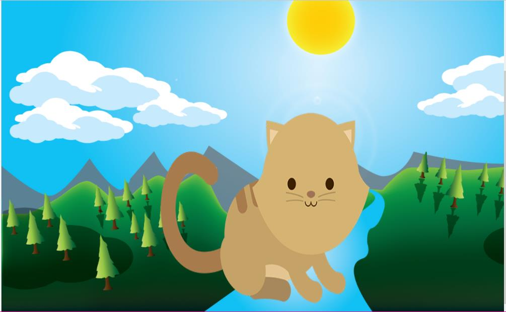
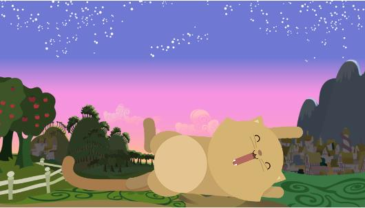
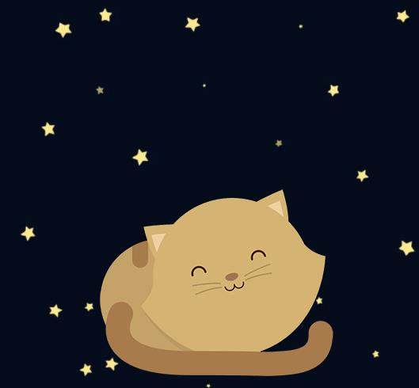

##OBJETIVO 

Crea una página web donde se muestre un paisaje y un gatito diferente a medida que la ventana del navegador se haga más pequeña.

##RECOMENDACIONES:
Entender bien que son las Media Queris y Viewport

#HERRAMIENTAS:

CSS3
HTML5

##AUTOR:
Nefeli joñoruco 